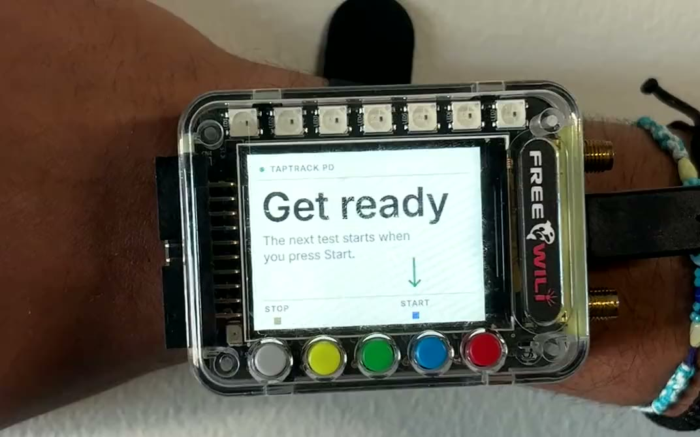
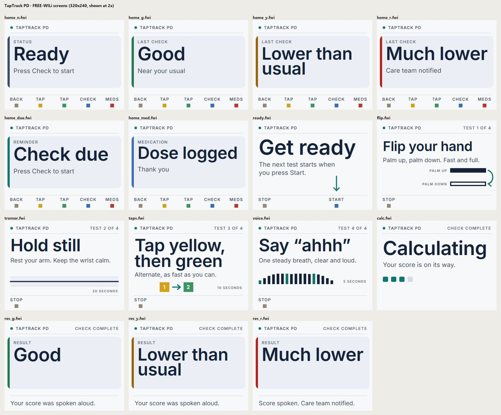
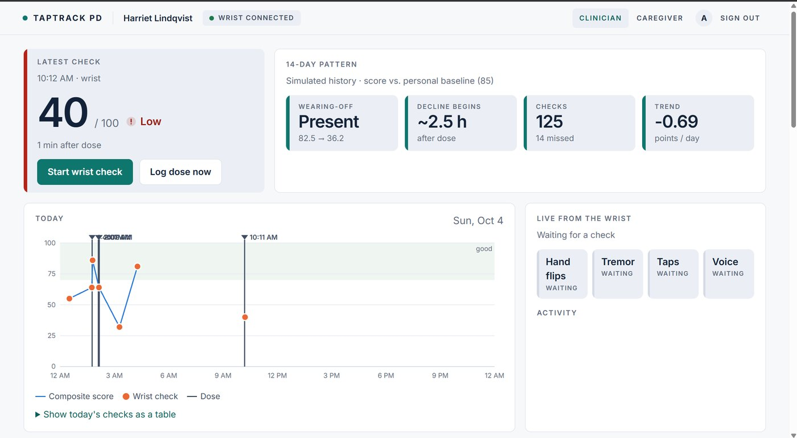
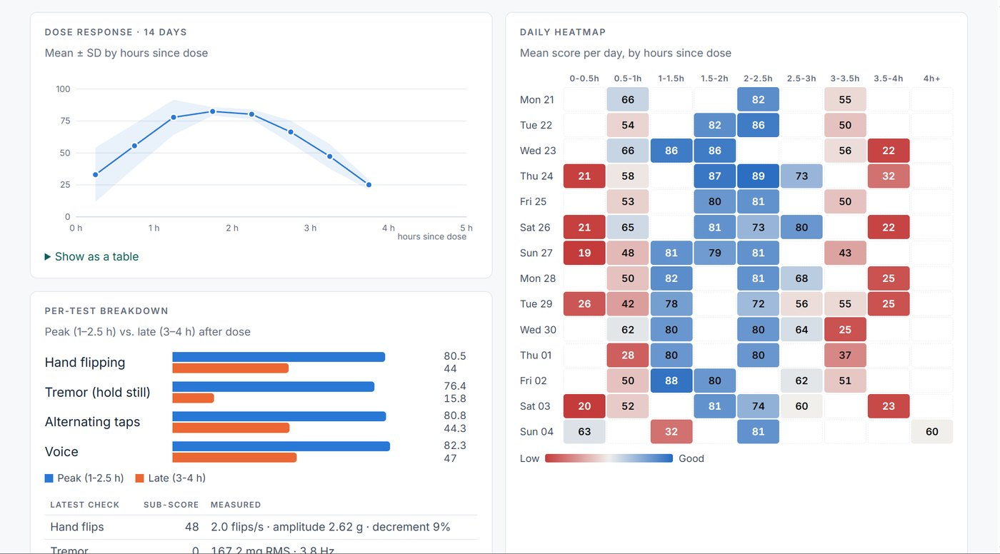
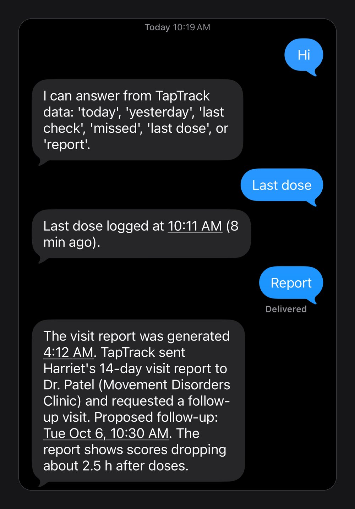

# TapTrack PD

A wrist-worn tracker for Parkinson's "wearing-off". A FREE-WILi on a watch strap runs a one-minute motor
check several times a day, tags every result with the time since the last levodopa dose, and turns two weeks
of checks into a dose-response picture for the neurologist. A care agent watches the data, texts the caregiver
over iMessage when a check comes back much lower than usual, and sends the clinic a visit report.

Built at MHacks 2026, where it won first place in the Tiger Data track.

<p align="center"></p>

_Decision support for clinicians, not a diagnostic device. All patient data in the screenshots is synthetic._

## How it works

```
FREE-WILi on the wrist ──USB──► bridge (Python) ──► metrics + score ──► TimescaleDB (or SQLite)
 buttons, accelerometer,         guided check,       numpy / scipy           │
 mic, screen, LEDs, speaker      screens, LEDs,                              ▼
                                 spoken prompts                    FastAPI + websocket ──► clinician / caregiver dashboards
                                                                             │
                                                   FinchNode (patient record) ◄──┴──► Gemini (visit report)
                                                                             │
                                                   Fetch.ai care agent ◄─────┘
                                                     ├─► clinic agent (follow-up slot)
                                                     └─► Photon sidecar ─► iMessage to caregiver / patient ◄─ replies
```

### On the wrist

The five buttons under the screen are gray, yellow, green, blue and red. Red logs a dose, blue starts a check,
gray cancels, and yellow/green are the tap test. A check runs four tests, each with an instruction screen, a
spoken prompt (ElevenLabs), an LED countdown and an LED progress bar:

| Test | Signal | Metrics |
|---|---|---|
| Hand flips, 10 s | accelerometer | flips/s, amplitude, decrement (first third vs last third) |
| Hold still, 20 s | accelerometer | tremor RMS, dominant frequency 3 to 12 Hz (FFT) |
| Alternating taps, 10 s | yellow / green buttons | taps/s, rhythm variability, decrement, errors |
| Say "ahhh", 5 s | microphone | loudness, stability |

The four tests combine into a 0 to 100 score against the patient's own baseline (85 is a usual day). The result
word is shown on the screen while the exact score is spoken. Passive tremor is also sampled between checks when
the wrist is still.

<p align="center"></p>

### Dashboard

The clinician view shows the latest check, the 14-day pattern, today's curve with dose markers, the dose-response
curve, a daily heatmap by hours since dose, a per-test breakdown, a live panel that fills in test by test over
the websocket, the FinchNode patient record, and the generated visit report. The caregiver view says the same
thing in plain words: how things look right now, the last and next dose, and missed checks.

<p align="center"></p>
<p align="center"></p>

### Care agent and iMessage

`taptrack-care` is a Fetch.ai uAgent (Agentverse mailbox, Agent Chat Protocol, reachable through ASI:One). It
polls the API and acts on what it sees: a "much lower" check texts the caregiver with the score, the usual, and
hours since the last dose; a missed scheduled check reminds the patient; a wearing-off pattern over 14 days makes
it generate the visit report and ask `taptrack-clinic`, a simulated clinic scheduling agent, for a follow-up slot.
Texts go through a small Photon sidecar, and caregivers can reply ("today", "last dose", "report") and get answers
from the data. The agent describes patterns only and refuses dose questions.

<p align="center"></p>

| Agent | Role | Address |
|---|---|---|
| `taptrack-care` | Care-team agent (mailbox, chat protocol, iMessage) | `agent1q0m06w5n433l7wlefgjw5pmvu0eweuepj3trmgp926wwn7wykjefs3pj0n2` |
| `taptrack-clinic` | Clinic scheduling agent, answers `FollowUpRequest` with a `FollowUpOffer` | `agent1qtnz8722nfr5vqsjd3qdwwgevuwnu4d3e5lvgcywnavd2j8xnvycyfsp8px` |

## Repository layout

```
taptrack/     app: device bridge, metrics and scoring, storage, FastAPI server, report generation, integrations
static/       clinician and caregiver dashboards (vanilla HTML/CSS/JS, no build step)
screens/      wrist screen designs: design.py renders SVG -> PNG -> .fwi for the 320x240 display
agent/        Fetch.ai agents (taptrack-care, taptrack-clinic)
photon/       iMessage sidecar (Node, Photon Spectrum)
hardware/     device checks and the measured hardware notes
scripts/      setup and tools: seed data, voice prompts, screen upload, Figma sync, end-to-end and UI checks
tests/        pytest suite (metrics, scoring, pipeline, API, report guard, notifications)
docs/         project landing page (GitHub Pages)
assets/       images used in this README
```

## Running it

Requirements: Python 3.11+, Node 20+ (iMessage sidecar), ffmpeg (only to regenerate voice prompts), and a
FREE-WILi on USB.

```bash
./start.sh            # first run installs everything; Ctrl+C stops all processes
./start.sh --demo     # replay synthetic data if the device is missing or unplugged
```

This starts the FastAPI server and wrist bridge, the Photon sidecar and the agents. Open http://127.0.0.1:8000,
sign in with any email and pick Clinician or Caregiver.

One-time device setup:

```bash
python hardware/device_test.py                                    # check the device over USB
python screens/design.py --fwi && python scripts/upload_screens.py   # 15 full-screen 320x240 images
python scripts/make_audio.py --upload                             # spoken instructions and beeps (8 kHz)
```

Uploads are content-hashed, so later runs only send changed files. The FREE-WILi plays every WAV at 8 kHz and has
no volume control, so prompts are generated at 8 kHz and scaled by `VOLUME`.

### Configuration

Everything lives in `.env` (copy `.env.example`). Each integration turns off gracefully without its key.

| Variable | Enables | Without it |
|---|---|---|
| `DATABASE_URL` | TimescaleDB hypertables (Postgres with the TimescaleDB extension) | local SQLite |
| `FINCHNODE_API_KEY` | FinchNode patient record and medications | FinchNode public demo record |
| `GEMINI_API_KEY` | Gemini-written visit report | template report |
| `ELEVENLABS_API_KEY` | ElevenLabs voice prompts | Windows SAPI voice |
| `PHOTON_PROJECT_ID`, `PHOTON_PROJECT_SECRET`, `CAREGIVER_PHONE`, `PATIENT_PHONE` | iMessage alerts and replies | messages logged as not sent |
| `AGENT_SEED` | fixed Fetch.ai agent address | generated once into `agent/.seed` |
| `VOLUME`, `FW_WAV_RATE`, `QUIET` | wrist audio level and rate, mute everything | |

## Tests

```bash
python -m pytest -q                           # metrics, scoring, pipeline, API, sign-in, report guard, notifications
python scripts/e2e_live.py --start --good     # a live check arriving in the browser over the websocket
python scripts/ui_audit.py                    # clicks through both dashboards and flags layout problems
```

## Hardware notes

The FREE-WILi's accelerometer stream is motion-gated (about 1 sample/s at rest on a table, 80 to 135 Hz when
worn), the tone API fails on firmware v54, and audio plays at 8 kHz regardless of the WAV header. These and the
other measured facts that shaped the design are in [hardware/NOTES.md](hardware/NOTES.md).

## License

MIT
